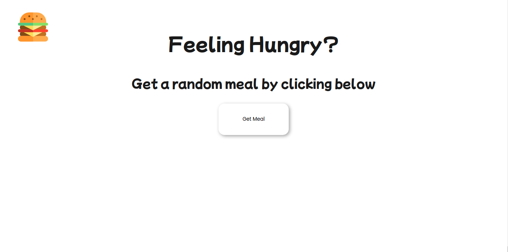
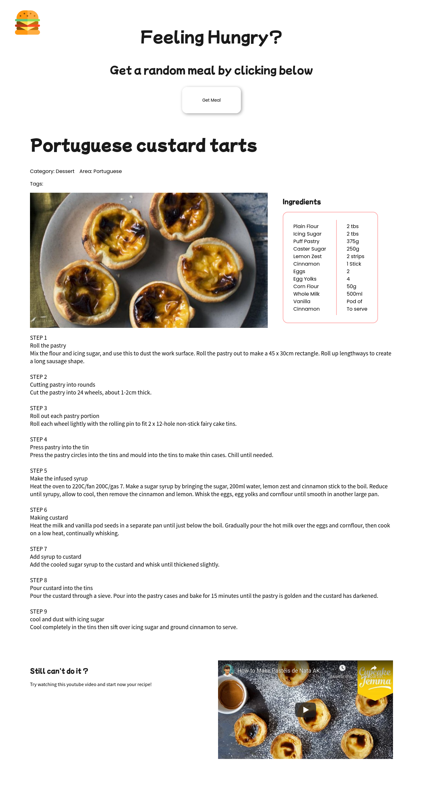
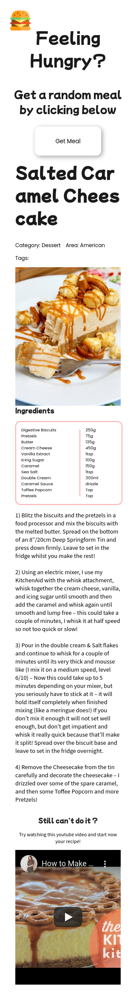

<h1 align="center">
    
</h1>

# MealNow

Este site foi baseado em uma das ideias dadas pelo repositório [app-ideas](https://github.com/florinpop17/app-ideas).

Consiste em um site que traz receitas de comidas aleatoriamente.

Para desenvolver o **design** me inspirei no exemplo dado pelo app-ideas como também pela forma que o [allrecipes](https://www.allrecipes.com/recipe/285644/cheesy-pumpkin-scones-with-walnuts-and-sage/) fazem a montagem das receitas

## Imagens

### Tecnologias utilizadas

- React JS
- Typescript
- HTML
- CSS
